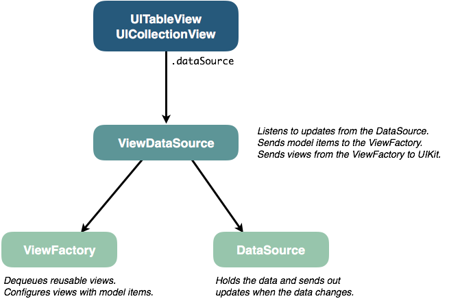
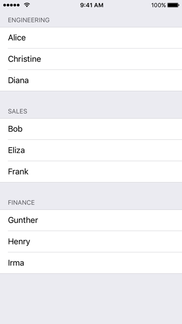

# SimpleSource

[](https://travis-ci.org/Squarespace/simple-source)
[](https://codecov.io/github/Squarespace/simple-source?branch=master)
[](https://opensource.org/licenses/Apache-2.0)
[](https://cocoapods.org/pods/SimpleSource)

## Quick Start

TL;DR?

SimpleSource is a library that lets you populate and update table views and collection views
with ease. It gives you fully typed closures so you don't have to cast views or items,
it lets you deal with model objects instead of index paths, and it handles the cell bookkeeping
for incremental updates.

Run the example app. Navigate the UI and see how little code is in each view controller.
Then come back here to learn more.

```sh
cd Examples/
pod install
open SimpleSourceExample.xcworkspace
```

## Contents

- [Introduction](#introduction)
- [Overview](#overview)
- [Installation](#installation)
- [Getting Started](#getting-started)
- [Examples](#examples)
- [Beyond the Basics](#beyond-the-basics)
- [Getting Help](#getting-help)
- [Contributing](#contributing)
- [Acknowledgements](#acknowledgements)
- [License](#license)

## Introduction

Never implement `UITableViewDataSource` or `UICollectionViewDataSource` again.

SimpleSource is a small, focused library that lets you

- Populate and update `UITableView` and `UICollectionView` views from manually
  managed arrays or Core Data.
- Forget about dequeuing and type casting cells. Forget about converting an
  `IndexPath` to a model object. SimpleSource will hand you dequeued views of the
  correct type along with the right model object for the index path. You can focus
  on applying your custom data to your custom view.
- Forget about cell bookkeeping. Just mutate your data, and SimpleSource will update,
  add, and remove items and sections in your views.

### That's it?

Those are the headline features, but sure, there's more.

- **Automatic diffs and animated updates.** Store your items in a regular old Swift `Array`.
  Simply reassign or mutate the array, and the correct incremental changes will be
  automatically applied to your table view or collection view – animating the corresponding
  rows in and out. Same thing for Core Data. Say goodbye to `reloadData()`.
- **Cleanly separate presentation logic from model data.** A SimpleSource *DataSource*
  object is all about the model data. It knows nothing about views. Not even whether it
  will be used to drive a table or collection view. Or how many views it will be delivering
  data to.
- **Built-in or custom views?** You decide. For `UITableView` you can use any built-in
  `UITableViewCellStyle` for the cells. And for headers and footers you can use the built-in
  text-based ones, which only require you to provide a string to display. But of course you
  can also use custom views for cells, headers, and footers.
- **Design in code or Interface Builder?** You decide. You tell SimpleSource how to dequeue
  your custom views. Either by directly instantiating a class, loading a NIB, using a
  storyboard prototype or (for table views) using one of the built-in cell styles.
- **Easy reordering of collection view cells.** Do you want drag-and-drop for items in your
  collection view? By giving SimpleSource an optional reordering delegate you can have
  drag-and-drop reordering in as little as 1 line of code. Check out the example project.

There will also be some slightly more advanced tips and tricks later in this document. Once
we have covered basic usage.

## Overview

There are 3 components involved when using SimpleSource. To populate a table view or
collection view you will need exactly one of each.

- **ViewDataSource** – This is the part you give to UIKit. It implements either
  `UITableViewDataSource` or `UICollectionViewDataSource` for you. To create one of these
  you need a *DataSource* and a *ViewFactory*.
- **DataSource** – This is where your items come from. If you want to keep them organized
  in arrays use a `BasicDataSource`. If you have them in Core Data use a `CoreDataSource`.
  The *DataSource* knows absolutely nothing about views.
- **ViewFactory** – This is responsible for creating and configuring your cells. Before
  creating the *ViewDataSource* you teach a *ViewFactory* how to create and configure all
  your different views from a model item. Later the *ViewDataSource* will find and pass
  the relevant model items to the *ViewFactory* for dequeueing and configuration, before
  finally sending the configured view to be displayed by UIKit.

> **In summary:**
>
> The table view or collection view asks the *ViewDataSource* for a view to display for a given index
> path. Using this index path, the *ViewDataSource* gets the corresponding model object from
> the *DataSource* and gives it to the *ViewFactory*. The *ViewFactory* then dequeues a cell,
> and uses the model object to configure the view before giving it back to the *ViewDataSource*.

We will use the terms *ViewDataSource*, *ViewFactory* and *DataSource* to speak about these
components in general.



There are a few different concrete implementations of each component type, depending on where
you get your data from (arrays or Core Data) and where you want to display it
(a table or a collection view):

| Component        | Class Names                                        |
| ---------------- | -------------------------------------------------- |
| *ViewDataSource* | `TableViewDataSource` / `CollectionViewDataSource` |
| *ViewFactory*    | `TableViewFactory` / `CollectionViewFactory`       |
| *DataSource*     | `BasicDataSource` / `CoreDataSource`               |

### What SimpleSource isn't

SimpleSource is strictly a data source for your views. In particular, it doesn't want to be
your view's delegate. Anything that has to do with cell/row selection, collection view layouts,
row heights etc. is up to you and your own delegate code.

The *DataSource* is not meant to be or replace your app's persistence layer:

- A `CoreDataSource` is just a wrapper around an `NSFetchedResultsController` that you
  create from your own database.
- A `BasicDataSource` is just a wrapper around a regular Swift array of items from anywhere
  you'd like.

We have also kept the clever protocols and generics to a minimum. Table views and collection views
have certain inherent differences. We accept that, and don't try to abstract everything away
behind a single API, which matches neither. And you shouldn't have to be a type theorist to
show an array of items in a table.

### What's the catch?

There shouldn't be any catch. No one wants to give up control to an opaque library.

With SimpleSource every moving part is either a closure which you provide, or an easily
replaceable component. The library is quite small, and is mostly just a
neat system for clicking different parts together into a flexible, functioning whole.

As you read further down in this document you will see how to support custom databases, disable
or adapt the animations to your liking etc.

## Installation

### CocoaPods

To include SimpleSource in a project using [CocoaPods](http://cocoapods.org) add the following
entry to your `Podfile`:

```ruby
pod 'SimpleSource'
```

Then run the command `pod install` to add SimpleSource to your workspace.

## Getting Started

We will build a simple example, showing a table of employees grouped by department.

### The Data

Just like `UITableView` and `UICollectionView`, SimpleSource is built around the concept of
items structured into sections. So our items will be employees, and our sections will be their
department.

We will use simple value types and arrays, so the `BasicDataSource` is right for the job.

This will be our employee object:

```swift
struct Employee {
    var name: String
}
```

Now for the sections, which will be departments. A section here is anything conforming to the
`SectionType` protocol.

A section only has to provide an `items` array. But we are free to add more properties to a
section, such as a title (or anything else we need) to properly configure section headers etc.

To illustrate this, let's also add the department name to make the model a little richer.

```swift
struct Department: SectionType {
    typealias ItemType = Employee
    var name: String
    var items: [ItemType]
}
```

Now we can build our data set:

```swift
// Employees
let alice = Employee(name: "Alice")
let bob = Employee(name: "Bob")
...

// Departments
let engineering = Department(name: "Engineering", items: [alice, christine, diana])
let sales = Department(name: "Sales", items: [bob, eliza, frank])
...

// Collect all departments
let departments = [engineering, sales, ...]
```

### The DataSource

Once we have the data, creating a `BasicDataSource` is easy:

```swift
let dataSource = BasicDataSource(sections: departments)
```

Note that `dataSource.sections` is a mutable array of `Department`. And for each section
`section.items` is a mutable array of `Employee`.

Once everything is up and running we can modify these arrays, and the table view will update
automatically with the proper animations.

### The ViewFactory

The next step on the way to a working table is to create a view factory. This will be
responsible for creating and configuring the cells.

A *ViewFactory* is created with a closure, which is called every time a new cell is about to be
dequeued. It returns the reuse identifier for the cell.

```swift
let viewFactory = TableViewFactory<Employee> { item, view in
    return "Cell"
}
```

> **Tip:** If you have more than one cell type in your view, look at the `item` passed to the
> closure (in our case, `item` will be of type `Employee`). Then decide which kind of cell to
> use and return the relevant reuse identifier.

Now we must teach the view factory what cells to dequeue for the `"Cell"` reuse identifier
and how to configure them. This is done through configuration closures.

In this simple case we use vanilla `UITableViewCell`s, so that is what the closure gets. But if
you have custom cell subclasses then that is what SimpleSource will send to your closure. No
need for type casting.

```swift
let configureCell = { (cell: UITableViewCell, employee: Employee, indexPath: IndexPath) -> Void in
    cell.textLabel?.text = employee.name
}

viewFactory.registerCell(
    method: .style(.default),
    reuseIdentifier: "Cell",
    in: tableView,
    configuration: configureCell
)
```

> **Tips:**
>
> If you are using a custom cell class it can be convenient to store the configuration closure
> as a static class variable on the cell. Then pass (for example) `EmployeeCell.configureCell`
> to `registerCell`. You can also store the reuse identifier this way. As, let's say,
> `EmployeeCell.defaultReuseIdentifier`.
>
> If you use trailing closure syntax you can do the configuration as part of the
> `registerCell` call.
>
> If your cell configuration closures require additional data not passed in by SimpleSource you can
> capture those dependencies when you create the closures. You will see an example of this next
> as we add the section header text to our table view.

For good measure, let's also tell the `viewFactory` to add a text header for each department
with the department name:

```swift
viewFactory.registerHeaderText(in: tableView) { section in
    return dataSource.sections[section].name
}
```

Notice how the configuration closure captures the data source here and uses it to get the name of
the department for every section header. This is fine, since the data source does not hold a strong
reference to anything but the model objects. But to avoid retain cycles you should be careful not
to capture something which eventually retains the view factory. Use `[weak ...]` annotations on
your configuration closures to break any retain cycles.

### The ViewDataSource

Now we are ready to create the `UITableViewDataSource` for our table view. This is going to be
an instance of `TableViewDataSource`.

```swift
let tableViewDataSource = TableViewDataSource(
    dataSource: dataSource, 
    viewFactory: viewFactory, 
    viewUpdate: tableView.defaultViewUpdate()
)
```

This is where we connect the `dataSource` and the `viewFactory`.

> **Note:** See the section on [live view updates](#live-view-updates) for an explanation
> of the `viewUpdate` parameter.

### Connect the Data Source

The only thing we need to do now is connect the `tableViewDataSource` to our table view:

```swift
tableView.dataSource = tableViewDataSource
```

And our table is ready:



### Live View Updates

We haven't mentioned how changes made to a *DataSource* end up in the view.

The *ViewDataSource* listens to the *DataSource* for data updates. These updates can either
come from the `NSFetchedResultsController` given to a `CoreDataSource` or from a diff
calculated by SimpleSource when you reassign the sections or item arrays in a `BasicDataSource`

These changes then have to be applied to the view.

When creating a *ViewDataSource* you also pass in a `viewUpdate` closure, which is responsible
for incorporating incremental changes into the view.

Most often you probably want to use one of the built-in row animations for table views, and
use `performBatchUpdates` for collection views.

For table views, SimpleSource defines `UITableView.defaultViewUpdate()` which does this
animated update for you. If you prefer an unanimated update you can use
`UITableView.unanimatedViewUpdate`. Or you can create your own. It's just a closure. You can
also pass your favorite `UITableViewRowAnimation` to `defaultViewUpdate()` to customize it.

For collection views, the built-in view updaters are called
`UICollectionView.defaultViewUpdate` and `UICollectionView.unanimatedViewUpdate`. Any
animations are provided by the collection view layout. See the UIKit documentation for
`initialLayoutAttributesForAppearingItem(at:)` and friends.

## Examples

There is a playground and an example project in the `Examples/` directory.

To try it out, run the following commands:

```sh
cd Examples/
pod install
open SimpleSourceExamples.xcworkspace
```

In this project you will see how to use both basic arrays and Core Data, how to create custom
headers and footers, how the views update automatically when you mutate the data source, how to
do drag-and-drop collection view reordering and more.

> **Note:** If you want to try the playground, make sure you open it via the
> `.xcworkspace` file. This will allow it to locate and build the necessary frameworks so
> it can import SimpleSource.

## Beyond the Basics

### Collection View Reordering

With SimpleSource, adding support for collection view cell reordering can be done in as
little as one line of code.

The first step is to make sure that the correct gesture handling is in place for your
collection view. This is outside the scope for SimpleSource, but see the documentation for the
property `installsStandardGestureForInteractiveMovement` on `UICollectionView`. Either set this
property to `true` or install your own custom gestures.

The `CollectionViewDataSource` class has an optional `reorderingDelegate` property which can be
set to indicate that cell reordering should be enabled.

This reordering delegate is defined by the `CollectionViewReorderingDelegate` protocol and is
responsible for making the necessary modifications in the *DataSource* when reordering
completes.

Implementing it for a `BasicDataSource` only requires one line of actual code:

```swift
func reordering(collectionView: UICollectionView, moveItemAt sourceIndexPath: IndexPath, to destinationIndexPath: IndexPath) {
    dataSource.moveItem(at: sourceIndexPath, to: destinationIndexPath)
}
```

Implementing `CollectionViewReorderingDelegate` when using a `CoreDataSource` requires you to
make modifications to your data that cause the object at `sourceIndexPath` to move to
`destinationIndexPath`. How to do that depends on both the Core Data model and the sort
criteria on the `NSFetchedResultsController` that the `CoreDataSource` was created from.

See the example app for a demo of cell reordering.

### More Tips

- **Do you like MVVM?** So do we! The view model is a great place to put your `DataSource`.
  Then keep the `ViewFactory` and `ViewDataSource` in the view layer. Either in your view
  controller or a helper class.
- **Bring your own database.** Out of the box, SimpleSource delivers support for items stored
  in manually managed arrays as well as Core Data (using `NSFetchedResultsController`). If you
  are using a different database, it is easy to write your own data source by conforming to the
  `DataSourceType` protocol. The rest of SimpleSource – cell dequeuing, view updates, cell
  configuration etc. – is designed to be modular, and will work just fine with your custom data
  source.
- **One data source. Multiple views.** Because a *DataSource* does not know anything about
  views, a single data source can be used to drive multiple views if necessary.
- **Custom animations.** If you have particular needs for how data updates are incorporated
  into your views you can write your own `viewUpdate` closure and pass it to the
  *ViewDataSource*.
- **Use multiple cell types.** If you have to display more than one cell type in your view,
  look at the `item` passed to the *ViewFactory* closure. Then decide which kind of cell to use
  and return the relevant reuse identifier. Each cell can then be configured using a type-safe
  closure, which gets an instance of that specific cell type and the item with which to
  configure it.
- **Use multiple item types.** If you want to use multiple cell types, chances are good that
  the items in your data source should also have multiple types. They might not share a common
  base class or protocol. In this case a good solution can be to wrap them in a Swift `enum`.
  Make each item/cell type a `case` in your `enum`, and store the items as associated values on
  the `enum` entries.

> **Example:** Imagine a typical settings screen in an app with support for different types of
> preferences. We need many different cell and item types, so we define each type of preference
> as a `case` in an `enum Preference`. Say the *ViewFactory* closure gets an item and sees that
> it is `Preference.boolean(name: String, value: Bool)`. It knows to return
> `SwitchCell.reuseIdentifier`. An instance of `SwitchCell` is now dequeued, and can be
> configured using the associated `name` and `value` to set up the title label and on/off
> switch for the preference.

## Getting Help

If you believe you have found a bug in SimpleSource please open a GitHub issue.

For general assistance please refer to the example app first. It covers almost the entire
public API surface, and each screen is dedicated to a particular need or use case.

If the example app does not answer your question ask it on
[Stack Overflow](http://stackoverflow.com/questions/tagged/simplesource)
and use the tag `simplesource`.

## Contributing

Contributions in the form of pull requests are very welcome.

Before your first pull request can be merged into the official SimpleSource repository, you
will be asked to sign a contributor license agreement, allowing Squarespace Inc. to include
your contribution. As the author you still reserve all right, title, and interest in and to
your contributions.

Please note that this project is released with a Contributor Code of Conduct. By participating
in this project you agree to abide by its terms. See the CONTRIBUTING.md file for more
information.

## Acknowledgements

The authors would like to thank and acknowledge
[TaylorSource](https://github.com/danthorpe/TaylorSource) by Dan Thorpe as an
inspiration for SimpleSource.

While the project scope, class hierarchy and protocol design of SimpleSource is quite different
from TaylorSource, it informed a lot of the early design decisions.

## License

[Apache 2.0](LICENSE) ([summary](https://tldrlegal.com/license/apache-license-2.0-(apache-2.0)))

Copyright (c) 2017, Squarespace, Inc.
